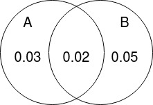

# Probabilidades

## Definición

$$
P(A) := \frac{|A|}{|\omega|} \rightarrow \frac{\textnormal{cantidad de resultados favorables a A}}{\textnormal{número de resultados}}
$$

## Ejercicio 1

Un experimento consiste en lanzar un dado, si el número es par se lanza una moneda. Si el número en el dado es impar, la moneda se lanza dos veces.

Usar la notación 2S, por ejemplo, para denotar el evento de que el dado muestre 2 y después la moneda salga sello y 1SC para denotar el evento de que el dado muestre 1 seguido por un sello y después una cara en la moneda.

a) Listar los elementos del espacio muestral de este experimento.

$$
\begin{array}{l}
\Omega=\{\\
2 S, 2 C, 4 S, 4 C, 6 S, 6 C, \\
1 S S, 1 S C, 1 C S, 1 C C, \\
3 S S, 3 S C, 3 C S, 3 C C, \\
\left.5 S S, 5 S C, 5 C S, 5 C C\right\}
\end{array}
$$

b) Calcular la probabilidad de que salga en el dado un número menor que 3 o bien ocurran dos sellos (o ambos).

$$
P(\left\{2 S, 2 C, 1 S S, 1 S C, 1 C S, 1 C C, 3 S S, 5 S S\right\})  = \frac{8}{18}
$$

c) Calcular la probabilidad de que salga en el dado un número menor que 4 y al menos una cara.

$$
B = \left\{ \\
2 C, 1 S C, 1 C S, 1 C C, \\
3 S C, 3 C S, 3 C C \\
\right\}
$$

$$
P(B) = \frac{7}{18}
$$

d) Calcular la probabilidad de que salga en el dado un número mayor o igual a 5 y al menos un sello.

$$
C = \left\{ \\
6 C, 5 S S, 5 S C, 5 C s, \\
\right\}
$$

$$
P(C) = \frac{4}{18} = 0.22
$$

e) Sabiendo que ocurre número impar en el dado. Calcular la probabilidad de que salgan dos sellos.

$$
\begin{array}{l}
{\Omega}' = \{\\
1 S S, 1 S C, 1 C S, 1 C C, \\
3 S S, 3 S C, 3 C S, 3 C C, \\
\left.5 S S, 5 S C, 5 C S, 5 C C\right\}
\end{array}
$$

$$
D = \left\{ \\
1 S S, 3 S S, 5 S S \\
\right\}
$$

$$
P(D) = \frac{3}{12} = 0.25
$$

## Ejercicio 2

En la producción de tornillos de cierta magnitud. El 5 % de ellos no tienen el largo correcto, el 7 % no tienen el diámetro correcto y el 2 % tiene ambos defectos. 

$$
A=\{\text{tornillos con defecto largo}\}
$$

$$
B=\{\text{tornillos con defecto diámetro}\}
$$

Se elige un tornillo al azar. Encontrar la probabilidad que:

a) Tenga al menos uno de los dos defectos.

$$
P(A) = 0.03 + 0.02 = 0.05
$$

$$
P(B) = 0.05 + 0.02 = 0.07
$$

Entonces

$$
\begin{aligned}
\mathrm{P}(\mathrm{A} \cup \mathrm{B}) &=\mathrm{P}(\mathrm{A})+\mathrm{P}(\mathrm{B})-\mathrm{P}(\mathrm{A} \cap \mathrm{B}) \\
&=0.05+0.07-0.02 \\
&=0.10
\end{aligned}
$$

b) Tenga sólo el defecto del largo.

$$
\begin{aligned}
\mathrm{P}(\mathrm{A}-\mathrm{B}) &=\mathrm{P}(\mathrm{A})-\mathrm{P}(\mathrm{A} \cap \mathrm{B}) \\
&=0.05-0.02 \\
&=0.03
\end{aligned}
$$

c) Tenga sólo uno de los dos defectos.

$$
\begin{aligned}
\mathrm{P}(\mathrm{A}-\mathrm{B})+\mathrm{P}(\mathrm{B}-\mathrm{A})= &(0,03)+[\mathrm{P}(\mathrm{B})-\mathrm{P}(\mathrm{A} \cap \mathrm{B})] \\
&=0.03+0.07-0.02 \\
&=0.08
\end{aligned}
$$

d) No tenga defectos.

$$
\begin{aligned}
\mathrm{P}(\mathrm{A} \cup \mathrm{B})^{c} &=1-\mathrm{P}(\mathrm{A} \cup \mathrm{B}) \\
&=1-0.10 \\
&=0.90
\end{aligned}
$$