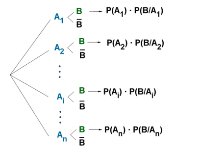
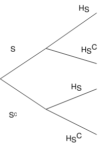
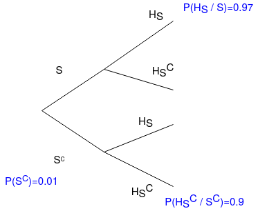
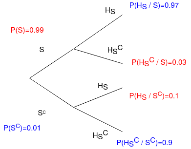

# Teorema de Bayes

$$
P(A / B)=\frac{P(B / A) P(A)}{P(B)}
$$

$$
\mathrm{P}\left(\mathrm{A}_{\mathrm{i}} / \mathrm{B}\right)=\frac{ \cdot \mathrm{P}\left(\mathrm{A}_{\mathrm{i}}\right) \mathrm{P}\left(\mathrm{B} / \mathrm{A}_{\mathrm{i}}\right)}{\mathrm{P}\left(\mathrm{A}_{1}\right) \cdot \mathrm{P}\left(\mathrm{B} / \mathrm{A}_{1}\right)+\ldots+\mathrm{P}\left(\mathrm{A}_{1}\right) \cdot \mathrm{P}\left(\mathrm{B} / \mathrm{A}_{\mathrm{n}}\right)}
$$

**Diagrama de Árbol**

## Ejercicio 1

Un administrador de la red informática de una empresa estima que la probabilidad de que en la red ingresen intrusos es de 0,01. Para asegurarse contrata a un hacker para que evalue la seguridad de la red.

El historial del hacker, permite suponer que evaluará la red como insegura cuando en realidad lo sea con probabilidad 0,90, mientras que la probabilidad que lo evalúe como segura dado que lo es, es de 0,97.

Datos

**Nomenclatura**

- $S:\text{Red segura}$
- $S^{c}:\text{Red insegura}$

- $H_{S}:\text{Hacker determina la red segura}$
- $H_{S}^{c}:\text{Hacker determina la red segura}$

**Diagrama de Árbol**

**Datos obtenidos del problema**

**Datos inferidos**

a) Determine la probabilidad de que el hacker evalue la red como insegura.

Respuesta

$$
P(H_{S}^{c}) = ??
$$

$$
P(H_{S}^{c}) = P(S) \cdot P(H_{S}^{c}/S) + P(S^c) \cdot P(H_{S}^c/S^c)
$$

$$
P(H_{S}^{c}) = 0.99 \cdot 0.33 + 0.01 \cdot 0.9 = 0.087
$$

b) Si el hacker concluye que la red es segura, ¿cuál es la probabilidad que no lo sea?

Respuesta

$$
P(S^c/H_{S}) = ??
$$

De independencia se sabe que:

$$
P(S^c/H_{S}) = \frac{P(H_{S} \cap S^c)}{P(H_{S})} \;\;\;\;\;\;\; P(H_{S}/S^c) = \frac{P(H_{S} \cap S^c)}{P(S^c)}
$$

Datos conocidos: $P(H_{S})$, $P(H_{S}/S^c)$ y $P(S^c)$.

Igualando con respecto a $P(H_{S} \cap S^c)$

$$
P(H_{S}) \cdot P(S^c/H_{S}) = P(S^c) \cdot P(H_{S}/S^c)
$$

Se despeja $P(S^c/H_{S})$ y se reemplazan los datos.

$$
P(S^c/H_{S}) = \frac{P(S^c) \cdot P(H_{S}/S^c)}{P(H_{S})} = \frac{0.01 \cdot 0.1 }{ 0.97 } = 0.001
$$

